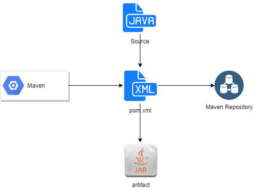
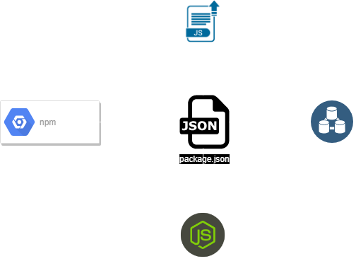
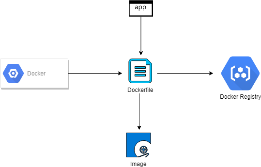

# Containers

### java

### nodejs

## Bare Metal
 * users and roles
 * prerequisites installed (jre/node/services/db etc)
 * prerequisites mapped (queues/db etc)
 * deploy scripts
 * startup scripts
 * Chef/Puppet

## VM

Source - [containers-and-virtual-machines](https://docs.docker.com/get-started/#containers-and-virtual-machines)
 * All of the above running in a guest os on a host os
 * Imaging support (infrastructure level/application level)
 * Initialization scripts

## Containers

Source - [containers-and-virtual-machines](https://docs.docker.com/get-started/#containers-and-virtual-machines)
 * Application runs as a discreate process 

 * Light weight
 * Self contained
 * Isolated
 * Immutable