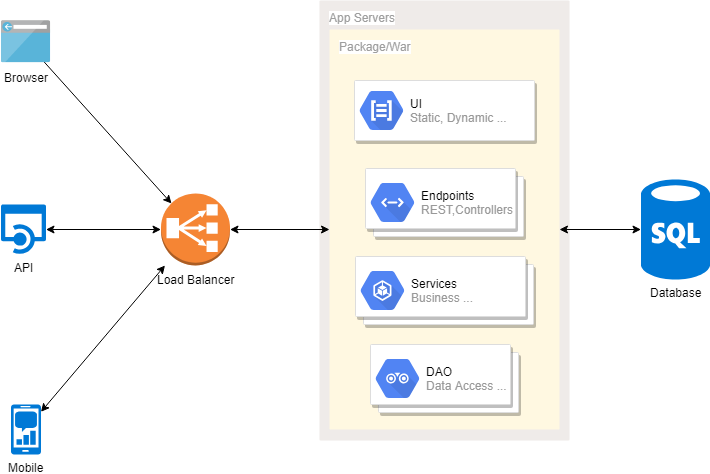
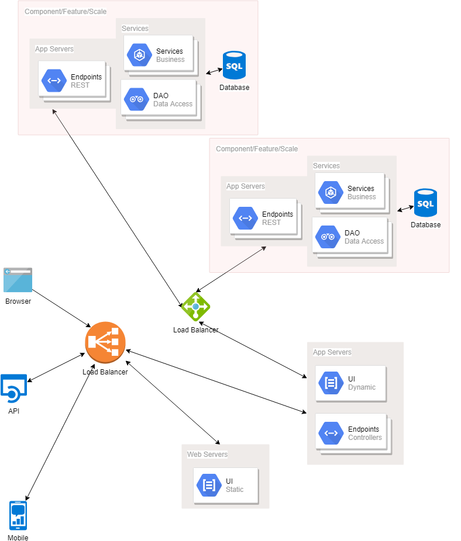

# Introduction

## Monolithic

  * Easy to build, deploy, scale and test
  * Issues
    * large code base
    * large team
    * productivity
    * startup
    * deployment
    * scaling
    * tech stack

## Micro Services

  * self contained, modular, productive, quick start, test, continuous deploy, stack upgradable, problem isolation
  * Issues
    * testing
    * discovery
    * communication standards/mech
    * service orchestration dev/deployment
    * distributed transactions
    * across teams
    * deployement resources
    * how - by business service, db separation, performance separation 

